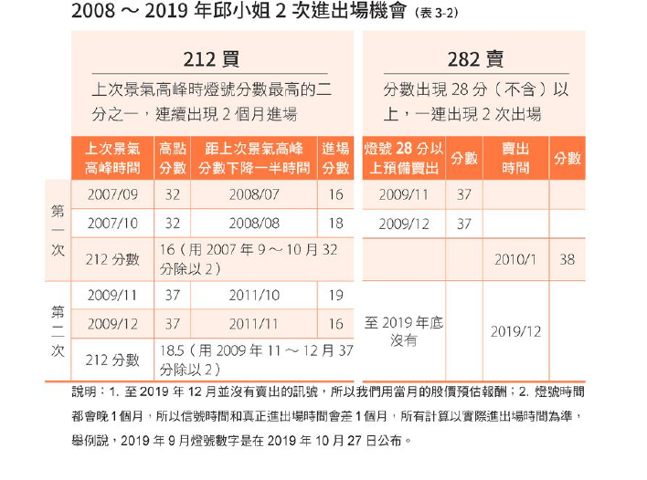
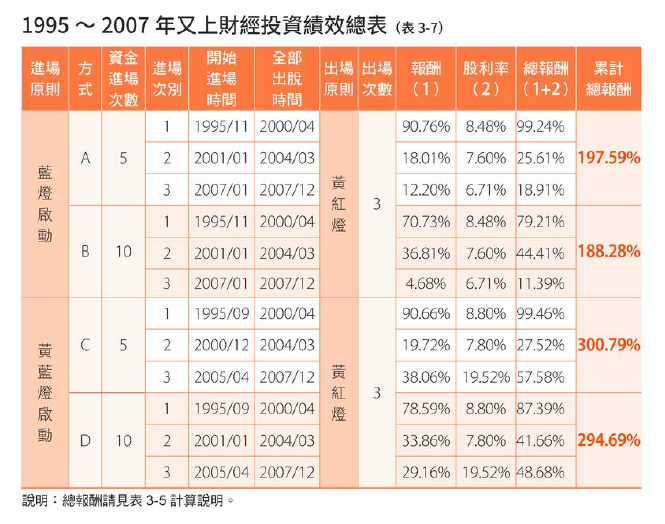

--- 
title: "Money learn"
author: "Chun Hsien Wu"
date: "`r Sys.Date()`"
site: bookdown::bookdown_site
output: bookdown::gitbook
documentclass: book
bibliography: [book.bib, packages.bib]
biblio-style: apalike
link-citations: yes
github-repo: rstudio/bookdown-demo
description: "This is a minimal example of using the bookdown package to write a book. The output format for this example is bookdown::gitbook."
---

# 阿甘投資法(闕右上)

 景氣對策信號指標 領先指標
邱沁宜操作心法

212 買股法則

景氣對策信號分數是上次景氣高峰 燈號分數最高的1/2時 且連續出現兩個月 代表可以進場買0050

282賣股法則

指當月景氣對策信號分數 出現28分以上 而且一連出現2個月 代表景氣渠熱絡 可以開始獲利了結

闕右上(判斷低點比高點準確) 藍燈(9-16)和黃藍燈(17-22)區域基本上就是台股的低點區 
  
  高點的判讀要擴大一個範圍包含了黃紅燈(32-37)和紅燈(38-45)兩個區域
  
闕右上作法 
分兩種
第一種 進入藍燈區（16分）以下 開始進場 採兩種方式
分五次或十次進場  
何時停止  1 資金用完 2 出現綠色燈號（23-31）

第二種 景氣對策信號進入黃藍燈（17-22）即開始進場 
同樣採 五次或十次進場
何時停止 1 資金用完 2 出現綠色燈號（23-31）

結局 ：闕右上的獲利比邱小姐的要高一些

  




```{r include=FALSE}
# automatically create a bib database for R packages
knitr::write_bib(c(
  .packages(), 'bookdown', 'knitr', 'rmarkdown'
), 'packages.bib')
```
